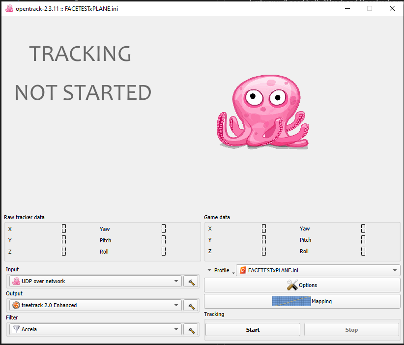
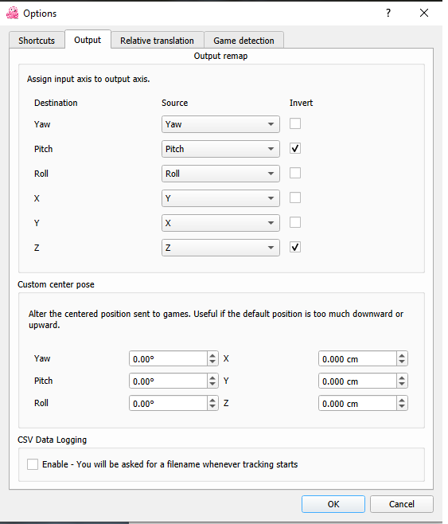

# User guide: Setup, common problems and tips

## Configuring opentrack and AiTrack

AiTrack sends data over UDP to opentrack, which in turn, sends it to your game, so both of them need to be running.

- You will need to create a new profile (under "Game Data" section, click the "Profile" drop down and create a new profile).

- Then, under "Input", select "UDP over network".

- In order to correct some of the noise AITrack has, it's recommended to use Acella filter on Opentrack with pretty high smoothing (over 2 degrees for rotation and about 1mm for position). However, Kalman filter works also okay (adjust its settings as you like).

Example of Opentrack configuration:

Then, on AITrack, just click "Start tracking". The program will use the default configuration, which assumes that opentrack is on the same machine and it's listening port is 4242 (Opentrack's default). In case you want to use other config, just change it on AITrack and save it.  After that, just click "Start" in Opentrack.

## Common problems
- If you find your head movements are inverted on your game:
    - Under `Options>Output` invert Pitch and Z axes. Also, swap X and Y axes if needed.

- If you find your view on the game making "strange jumps":
    - Look at the video preview on AITrack and confirm the facial landmarks are correctly positioned.
        - If not, check your illumination, and the angle your have your camera.
    - If the landmarks are recognized correctly try fine-tunning the distance parameter on AITrack. (Don't forget to click **Apply** each time you make any change).

- If the view makes "jumps" when you move your head try adjusting the curves on Opentrack (`Mapping` button).
    - See **Tips** section
    - Here is a video with some tips https://www.youtube.com/watch?v=u0TBI7SoGkc on how to configure your curves.

- If you  move left/right my your goes up/down:
    - You have to flip your X and Y axes in Opentrack (see screenshot above: Options>Output). 

## Tips

Based on the testing made so far, here are some recommendations for getting the best performance:
 
-  Configure well your movement curves on Opentrack. Leave a little "dead zone" at the beginning of each curve and use the asymetric mapping feature for "Pitch".
- Position your camera at about 0.5-2 meters horizontally from your face.
    * It's better if the camera is directly in front of you, but it doesn't mattter if you have some lateral offset.
-  The camera should be, approximately,  at about your nose-level. Good positions are on top of our monitor, or at its base.
- You shouldn't need to touch "Initial parameters" on AITrack. If you find the tracking is not accurate, fine-tune "Distance" parameter only to the actual value (distance from your face to the camera, in meters).
- Use an Acella filter with Opentrack and set the smoothing near the maximum values (both rotation and position).