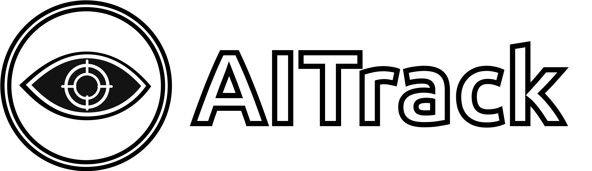

 - The open head tracker - 

## What is this?

AITrack is a 6-Degree of Freedom headtracker designed to work alongside [Opentrack](https://github.com/opentrack/opentrack) for its use in simulators/games. 

AITrack uses its own tracking pipeline (based on neural networks) to estimate the user's head position with respect to the webcam and then, streams it to Opentrack, which in turn, transmits it to your games.

### Main features

* Hardware (IR LEDs, specific hardware...) free headtracking solution.
* Good performance under poor light conditions.
* Good detection with partial face occlusion (using glasses).
* Reasonable low CPU percentage consumption.
* Remote-running capability. You can use a second PC (for example, a laptop)to stream the tracking data to your main machine.

## Installing and running

1. Download and install [Visual C++ Redistributable x64](https://aka.ms/vs/16/release/vc_redist.x64.exe) in case you don't already have it.
2. Download Opentrack from [Opentrack's releases page](https://github.com/opentrack/opentrack/releases)
2. Download the most recent version of the tracker from the [releases page](https://github.com/AIRLegend/aitracker/releases) (.zip file) and extract its content.
4. Run Opentrack and make sure to select Input = **UDP over network**, then, click "Start". Opentrack then will be for the data AITrack will send.
5. Run `AITrack.exe` from AITrack and click "Start tracking". 
6. Look around!

**IMPORTANT:**
In case you want to know more, please, head to the `Doc/` directory to find guides about usage. If you can't find there what you're looking for, feel free to post your question on the [issues page](https://github.com/AIRLegend/aitracker/issues).

## Showoff videos
[] TODO

## Bugs and Contributing

If you encounter any bug/problem or you have some idea, post it on the [issues page](https://github.com/AIRLegend/aitracker/issues) to find help or further discussion. If you decide to fix something or implement a request, feel free to fork this repo, develop your new feature in a separate branch and then, make a PR to review it, here is the [guide to developers](Doc/DEVELOP.md). 

Thank you!

## Acknowledgements

- [inspirit](https://github.com/inspirit), for the PS3 C++ camera library which I used during development.
- [emilianavt](https://github.com/emilianavt/), for porting the original Pytorch pretrained models to ONNX.